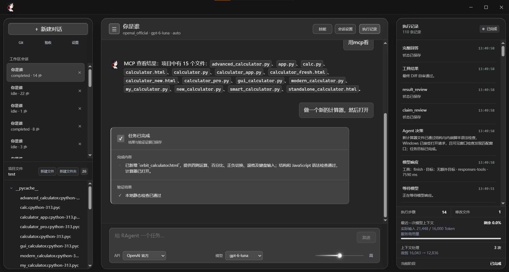
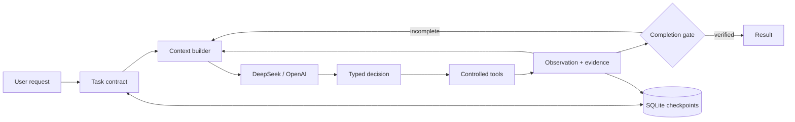

# RAgent

**A local-first desktop coding agent that reads repositories, edits files, runs verification, and preserves auditable evidence.**

[中文说明](README.zh-CN.md)



RAgent connects DeepSeek or OpenAI models to a controlled local workspace. The model proposes typed actions; the runtime owns path boundaries, permissions, file mutations, command execution, verification, persistence, and the final completion decision.

The result is a coding agent designed around one rule: a task is complete only when the workspace state and available verification evidence support that conclusion.

## Highlights

- **Structured agent loop** — planning, repository inspection, editing, command execution, observation, recovery, and completion use typed actions instead of free-form shell output.
- **Verification-aware completion** — code changes invalidate stale evidence; related tests and project checks are discovered and recorded before verified completion.
- **Layered long-context management** — current requirements, task state, recent dialogue, file evidence, and older history are budgeted separately and compacted when necessary.
- **Task contracts and semantic intent** — each turn tracks the active objective, target files, protected scope, acceptance conditions, and user corrections.
- **Scoped permissions** — file access and commands are evaluated by operation, path, impact, and risk, with one-time or session-scoped approval.
- **Durable recovery** — sessions, plans, observations, file changes, and context summaries are checkpointed in SQLite for safe continuation after interruption.
- **Local project workspace** — persistent conversations, hierarchical file tree, file/folder creation, Diff review, Git operations, execution trace, and context usage are available in one desktop UI.
- **Local credential storage** — API keys are stored through the operating system keyring and are not written to the repository or session database.

## How it works



The model can request repository reads, searches, precise edits, file operations, verification commands, or a final response. RAgent validates every request against the active workspace and permission policy before performing side effects.

## Desktop workspace

The desktop application is organized into three coordinated areas:

1. **Workspace** — conversations, repository tree, nested folders, changed-file markers, and direct file/folder creation.
2. **Conversation** — natural-language tasks, Markdown/code rendering, completion evidence, runtime diagnostics, and live corrections.
3. **Execution trace** — model decisions, tool results, permissions, verification events, context usage, and compression history.

Git, acceptance checks, skills, provider configuration, verification mode, response style, and reasoning effort are available without leaving the workspace.

## Safety model

- Repository paths are resolved and checked before access.
- Protected metadata such as `.git`, `.github`, and `.codex` cannot be modified through file tools.
- Commands pass capability checks and permission evaluation before execution.
- Destructive actions require explicit approval and display their concrete scope.
- Completion is based on runtime state and evidence, not solely on a model claim.
- Credentials are excluded from prompts, SQLite events, logs, and Git.

## Tech stack

| Layer | Technology |
|---|---|
| Agent runtime | Python 3.11+, Pydantic |
| Local API | FastAPI, Uvicorn |
| Desktop UI | React, TypeScript, Vite, PyWebView |
| Persistence | SQLite |
| Verification | pytest, project-aware command discovery |
| Providers | DeepSeek API, OpenAI API, OpenAI-compatible gateways |
| Packaging | PyInstaller |

## Quick start

### Run from source

```powershell
git clone https://github.com/rochihihi/ragent.git
cd ragent
python -m venv .venv
.\.venv\Scripts\python.exe -m pip install -e ".[dev,desktop]"
.\.venv\Scripts\ragent-desktop.exe
```

Configure a provider from the application settings, choose a repository, and create a conversation.

### Build the Windows executable

Install Node.js and the Python dependencies first, then run:

```powershell
.\.venv\Scripts\python.exe scripts\build_desktop.py
```

The packaged application is written to `dist/RAgent.exe`.

### Start the local web workspace

```powershell
.\.venv\Scripts\ragent.exe serve --host 127.0.0.1 --port 8000
```

Open <http://127.0.0.1:8000>. The API is local-first and should not be exposed directly as a public execution service.

## Validation

```powershell
.\.venv\Scripts\python.exe -m pytest -q
cd frontend
npm install
npm run check
npm run build
```

The test suite covers task contracts, intent handling, permission boundaries, file operations, context compaction, verification gates, persistence, and recovery behavior.

## Project structure

```text
src/veripatch/       agent runtime, providers, tools, persistence, and API
frontend/            React desktop workspace
tests/               runtime, security, recovery, and integration tests
scripts/             Windows packaging script
examples/            local demonstration projects
```

## License

[MIT](LICENSE)
