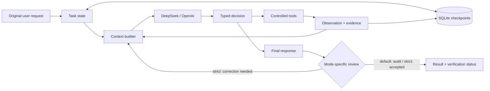

# RAgent

**A local-first desktop coding agent with model-led decisions, controlled tools, and auditable execution.**

[中文说明](README.zh-CN.md)


RAgent connects DeepSeek or OpenAI models to a controlled local workspace. The execution model interprets the user's original request, chooses typed actions, and decides when to respond. The local runtime enforces path boundaries, permissions, safe file operations, and persistence, while recording tool results and verification evidence.

In the desktop Studio's default Auto/Quick modes, evidence is returned to the model without imposing a fixed test-and-reopen workflow. Strict verification is an opt-in mode with additional runtime completion gates. A completed turn does not by itself mean that tests passed; verification status is reported separately.

## Highlights

- **Structured agent loop** — planning, repository inspection, editing, command execution, observation, recovery, and completion use typed actions instead of free-form shell output.
- **Evidence-aware verification** — file changes invalidate stale evidence. The model decides relevant checks in default modes; Strict mode adds runtime verification gates.
- **Layered long-context management** — current requirements, task state, recent dialogue, file evidence, and older history are budgeted separately and compacted when necessary.
- **Original-request authority** — the execution model interprets intent from the original request and dialogue, without a separate preflight intent classifier. Plans and task summaries are advisory, not replacements for user instructions.
- **Pause and resume** — desktop tasks have no default fixed decision-step limit. Pause cancels pending model I/O; synchronous tools finish and save their results before pausing. Saved work can be resumed.
- **Safe creation semantics** — creating an existing path returns a conflict instead of silently becoming an edit. The model can choose a new path; this does not prevent explicitly requested edits.
- **Answer auditing** — default-mode evidence review is logged separately and does not replace the model's answer with a canned evidence message. Strict review may request a correction.
- **Scoped permissions** — file access and commands are evaluated by operation, path, impact, and risk, with one-time or session-scoped approval.
- **Durable recovery** — sessions, plans, observations, file changes, and context summaries are checkpointed in SQLite for safe continuation after interruption.
- **Local project workspace** — persistent conversations, hierarchical file tree, file/folder creation, Diff review, Git operations, execution trace, and context usage are available in one desktop UI.
- **Local credential storage** — API keys are stored through the operating system keyring and are not written to the repository or session database.

## How it works


```mermaid
flowchart LR
    U[Original user request] --> C[Task state]
    C --> X[Context builder]
    X --> M[DeepSeek / OpenAI]
    M --> D[Typed decision]
    D --> T[Controlled tools]
    T --> O[Observation + evidence]
    O --> X
    D --> A[Final response]
    A --> V{Mode-specific review}
    V -->|default: audit / strict: accepted| R[Result + verification status]
    V -->|strict: correction needed| X
    C <--> S[(SQLite checkpoints)]
    O --> S
```

The model can request repository reads, searches, precise edits, file operations, verification commands, or a final response. RAgent validates every request against the active workspace and permission policy before performing side effects.

Tool results, including successful tests or launches, return to the model. Local control flow does not require reopening an artifact after verification. Intent and action selection are model decisions; access checks, approval enforcement, creation conflicts, and pause handling are local controls.

## Desktop workspace

The desktop application is organized into three coordinated areas:

1. **Workspace** — conversations, repository tree, nested folders, changed-file markers, and direct file/folder creation.
2. **Conversation** — natural-language tasks, Markdown/code rendering, completion evidence, runtime diagnostics, and live corrections.
3. **Execution trace** — model decisions, tool results, permissions, verification events, context usage, and compression history. Detailed/all-record views load the full saved event history and allow inspection of long messages and tool payloads.

Git, acceptance checks, skills, provider configuration, verification mode, response style, and reasoning effort are available without leaving the workspace.

## Safety model

- Repository paths are resolved and checked before access.
- Protected metadata such as `.git`, `.github`, and `.codex` cannot be modified through file tools.
- Commands pass capability checks and permission evaluation before execution.
- Destructive actions require explicit approval and display their concrete scope.
- Default completion is model-led with evidence auditing; Strict mode adds runtime gates. Neither completion nor a launch request alone proves that tests passed or a GUI was visually verified.
- Credentials are excluded from prompts, SQLite events, logs, and Git.

## Tech stack

| Layer | Technology |
|---|---|
| Agent runtime | Python 3.11+, Pydantic |
| Local API | FastAPI, Uvicorn |
| Desktop UI | React, TypeScript, Vite, PyWebView |
| Persistence | SQLite |
| Verification | pytest, project-aware command discovery |
| Providers | DeepSeek API, OpenAI API, OpenAI-compatible gateways |
| Packaging | PyInstaller |

## Quick start

### Run from source

```powershell
git clone https://github.com/rochihihi/ragent.git
cd ragent
python -m venv .venv
.\.venv\Scripts\python.exe -m pip install -e ".[dev,desktop]"
.\.venv\Scripts\ragent-desktop.exe
```

Configure a provider from the application settings, choose a repository, and create a conversation.

### Build the Windows executable

Install Node.js and the Python dependencies first, then run:

```powershell
.\.venv\Scripts\python.exe scripts\build_desktop.py
```

The packaged application is written to `dist/RAgent.exe`.

### Start the local web workspace

```powershell
.\.venv\Scripts\ragent.exe serve --host 127.0.0.1 --port 8000
```

Open <http://127.0.0.1:8000>. The API is local-first and should not be exposed directly as a public execution service.

## Validation

```powershell
.\.venv\Scripts\python.exe -m pytest -q
cd frontend
npm install
npm run check
npm run test:trace
npm run build
```

The test suite covers original-request authority, creation conflicts, answer preservation, pause/resume, permission boundaries, context compaction, verification modes, full execution history, persistence, and recovery behavior.

## Project structure

```text
src/veripatch/       agent runtime, providers, tools, persistence, and API
frontend/            React desktop workspace
tests/               runtime, security, recovery, and integration tests
scripts/             Windows packaging script
examples/            local demonstration projects
```

## License

[MIT](LICENSE)
