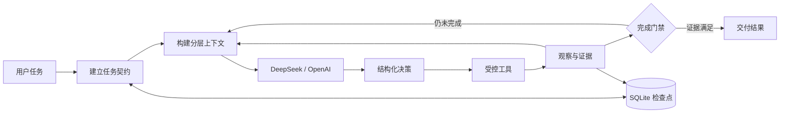

# RAgent

**一个本地优先、以验证证据为完成标准的桌面编程 Agent。**

[English README](README.md)


RAgent 将 DeepSeek 或 OpenAI 模型接入受控的本地项目工作区。模型负责提出结构化动作，确定性运行时负责路径边界、权限判断、文件变更、命令执行、结果验证、状态持久化与最终完成判定。

它遵循一个核心原则：只有当前项目状态和验证证据能够支持任务目标时，任务才算真正完成。

## 核心能力

- **结构化 Agent 循环**：规划、项目检索、代码修改、命令执行、结果观察、失败恢复和完成响应均使用明确的动作协议。
- **验证门禁**：代码发生变化后自动废弃旧验证证据，发现关联测试与项目检查，避免把“模型说完成了”当作真实完成。
- **分层长上下文管理**：分别管理当前需求、任务状态、近期对话、文件证据和历史信息，在接近预算时压缩低优先级内容。
- **任务契约与语义意图**：持续记录当前目标、目标文件、保护范围、验收条件和用户运行中纠正，减少长任务中的目标漂移。
- **范围化权限系统**：根据操作类型、目标路径、影响和风险进行判断，支持单次允许与本会话同类操作授权。
- **持久化与恢复**：使用 SQLite 保存会话、计划、观察、文件变更和上下文摘要，中断后可以从现有证据继续。
- **本地项目工作台**：提供持久化对话、层级文件树、文件/文件夹创建、Diff 审查、Git 操作、执行轨迹与上下文占用展示。
- **本地凭据管理**：API 密钥通过操作系统 Keyring 保存，不写入项目仓库或会话数据库。

## 工作流程



模型可以请求读取与搜索项目、精确编辑、文件操作、验证命令或最终回复。所有副作用操作都会先经过工作区边界和权限策略检查。

## 桌面工作区

界面由三个协同区域组成：

1. **工作区**：会话列表、项目文件树、嵌套目录、变更标记，以及直接新建文件和文件夹。
2. **对话区**：自然语言任务、Markdown 与代码显示、完成证据、运行诊断和任务纠正。
3. **执行记录**：模型决策、工具结果、权限事件、验证记录、上下文占用和压缩历史。

Git、升级验收、技能、模型配置、验证模式、回答风格和推理强度均可在工作台内完成配置。

## 安全边界

- 文件访问前会解析并校验真实路径，防止越出当前工作区。
- `.git`、`.github`、`.codex` 等项目元数据不能通过文件工具修改。
- 命令执行前必须通过能力分析和权限判断。
- 删除等高风险操作必须明确授权，并显示实际影响范围。
- 完成状态由运行时和验证证据共同决定，不依赖模型自我声明。
- 凭据不会进入提示词、SQLite 事件、日志或 Git。

## 技术栈

| 模块 | 技术 |
|---|---|
| Agent 运行时 | Python 3.11+、Pydantic |
| 本地 API | FastAPI、Uvicorn |
| 桌面界面 | React、TypeScript、Vite、PyWebView |
| 状态持久化 | SQLite |
| 结果验证 | pytest、项目感知的验证命令发现 |
| 模型接入 | DeepSeek API、OpenAI 官方 API、OpenAI 兼容中转站 |
| Windows 打包 | PyInstaller |

## 快速开始

### 从源码运行

```powershell
git clone https://github.com/rochihihi/ragent.git
cd ragent
python -m venv .venv
.\.venv\Scripts\python.exe -m pip install -e ".[dev,desktop]"
.\.venv\Scripts\ragent-desktop.exe
```

在应用设置中配置模型服务，选择本地项目文件夹，然后创建对话即可。

### 构建 Windows 程序

安装 Node.js 和 Python 依赖后运行：

```powershell
.\.venv\Scripts\python.exe scripts\build_desktop.py
```

打包结果位于 `dist/RAgent.exe`。

### 启动本地 Web 工作台

```powershell
.\.venv\Scripts\ragent.exe serve --host 127.0.0.1 --port 8000
```

浏览器打开 <http://127.0.0.1:8000>。RAgent 默认面向本地使用，不应直接作为公网执行服务暴露。

## 验证项目

```powershell
.\.venv\Scripts\python.exe -m pytest -q
cd frontend
npm install
npm run check
npm run build
```

测试覆盖任务契约、意图识别、权限边界、文件操作、上下文压缩、验证门禁、状态持久化和失败恢复等核心行为。

## 项目结构

```text
src/veripatch/       Agent 运行时、模型适配器、工具、持久化与 API
frontend/            React 桌面工作台
tests/               运行时、安全、恢复和集成测试
scripts/             Windows 打包脚本
examples/            本地演示项目
```

## 开源许可

[MIT](LICENSE)
