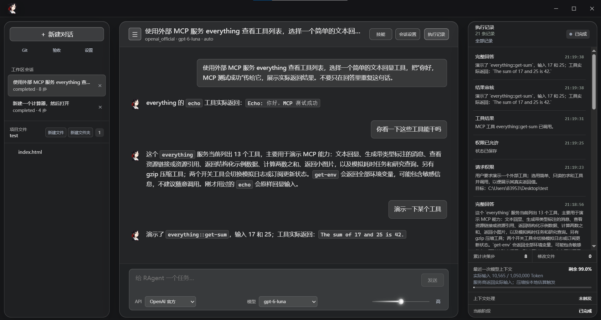

# RAgent

本地优先的 Windows 桌面编程 Agent：模型选择动作，本地运行时控制执行、权限和恢复。

[English README](README.md)



将 DeepSeek、OpenAI 或 OpenAI 兼容中转站接入本地项目，完成代码查看、文件创建、修改、检查和结果解释。对话与任务证据通过 SQLite 保存在本地。

本地优先不等于离线推理：选定的项目内容会发送给配置的模型服务商，外部 MCP 工具也可能接收调用参数。

## 主要功能

- **模型驱动**：只保留 Studio 一套运行流程。模型理解原始请求并选择工具、计划、验证和回答；计划不授予权限。
- **桌面工作台**：持久化对话、项目树、文件创建、Diff、Git、技能、执行记录与单次上下文占用。
- **受控执行**：具体命令/参数展示、单次和匹配范围的会话授权、原生工作区路径校验及项目元数据保护。
- **暂停恢复**：默认无固定决策步数上限。可取消待完成的模型请求；同步工具执行完并保存结果后暂停。恢复时不盲目重跑结果不明的调用。
- **验证反馈**：模型选择相关检查，必要时编写测试；失败作为工具证据反馈。默认模式不强制“测试后再打开”，Strict 增加完成门禁。“完成”不等于测试通过或已目视验证 GUI。
- **上下文管理**：模型生成历史摘要并记录覆盖范围，本地负责预算和备用裁剪。当前上下文大小与累计用量分开统计。
  OpenAI 官方 Responses 请求额外启用服务端自动压缩（默认阈值 200,000 token，可通过 `VERIPATCH_OPENAI_COMPACT_THRESHOLD` 调整）；工具调用链通过 `previous_response_id` 保留服务端压缩状态。新用户轮次仍重新组装本地上下文，跨轮历史摘要机制保留；DeepSeek 和中转接口不发送此参数。明确拒绝该参数时回退普通 Responses，其他请求错误不因此自动重发。
- **文件保护**：新建冲突不自动转编辑。准备好的修改在最新内容中匹配唯一的精确目标，保留无关改动；目标缺失或重复时拒绝覆盖。
- **外部 MCP**：界面配置 stdio / Streamable HTTP 服务、连接测试、工具发现和审批调用。本地操作使用原生工具，无需内置 MCP 服务 EXE。
- **凭据管理**：已保存密钥优先，环境变量备用；系统 Keyring 不可用时尝试 Windows DPAPI 加密存储。删除保存的密钥可能回退使用环境变量。

## 执行方式

```text
用户请求 → 上下文 → 模型决策 → 权限/工具检查 → 执行
             ↑                               ↓
             └──────── 工具结果与证据 ─────────┘
```

Python 执行模型提出的动作，保存观察并反馈模型。最终回答由模型生成，证据审计和各模式的完成检查由本地处理。

多文件回滚是尽力恢复：只有文件仍等于刚写入内容时，才恢复本次写入前保存的文本。没有跨进程文件锁、语义合并或保证全部成功/撤销的事务。

## 从源码运行

需要 Windows、Python 3.11+、Node.js/npm、模型服务商账户和支持的 PyWebView 后端（Windows 可能需要 WebView2 Runtime）。

```powershell
git clone https://github.com/rochihihi/RAgent.git
cd RAgent
python -m venv .venv
.\.venv\Scripts\python.exe -m pip install -e ".[dev,desktop]"
npm --prefix frontend ci
npm --prefix frontend run build
.\.venv\Scripts\ragent-desktop.exe
```

在界面配置服务商，选择项目目录并创建对话。源码运行使用可编辑安装，确保桌面程序能定位仓库中构建好的前端资源。

旧 `ragent` / `veripatch` 命令行功能（包括 `serve`、`auth`、`quota`）已移除。桌面启动入口保留；凭据和余额在界面管理，余额查询能力取决于服务商/中转站。

## 构建 Windows EXE

安装上述依赖后：

```powershell
.\.venv\Scripts\python.exe scripts\build_desktop.py
```

脚本构建前端并生成单个 `dist/RAgent.exe`。EXE、构建缓存、备份和私有配置不提交到仓库。打包后仍需联网访问模型；外部 stdio 服务需自行准备运行环境。

## 外部 MCP

在 MCP 服务管理中配置服务，配置通常保存在 `%APPDATA%\RAgent\mcp_servers.json`。连接测试进行协议初始化和工具发现，不逐个执行业务操作。调用使用 `server::tool`。

只启用可信服务：外部工具可能运行程序、修改数据或联网，不受原生文件工具边界完整约束。审批不是第三方服务的沙箱。

详见[外部 MCP 配置](docs/EXTERNAL_MCP.md)。当前没有 OAuth 流程、旧 HTTP SSE 传输或持久连接复用。

## 开发验证

```powershell
npm --prefix frontend run check:vue
npm --prefix frontend run build
```

本次源码发布仅包含运行时、Vue 界面、打包脚本和必要资源，不上传本地回归测试、生成的 EXE 或备份。界面的验收功能保留，直接检查生产代码，不调用模型。

## 目录和技术栈

```text
src/veripatch/   Studio 运行时、适配器、工具、API 和持久化
frontend/vue/   Vue 3 桌面界面
frontend/src/   共享 API 类型、工具函数和样式
scripts/        桌面打包脚本
assets/         桌面资源与截图
examples/       示例项目
docs/           外部 MCP 配置
```

Python、Pydantic、FastAPI/Uvicorn、SQLite、Vue 3/TypeScript/Vite、PyWebView、MCP SDK、PyInstaller。Python 内部包名仍为 `veripatch`。

## 安全边界

本地 API 保持回环监听，不作为公网执行服务。原生文件工具保护路径和元数据，但获准命令和外部工具可能产生更广影响。审批前检查破坏性操作，重要项目使用 Git/备份。

凭据与模型上下文分开处理，但文件和工具输出仍可能包含敏感信息，请检查暴露给服务商和外部服务的内容。

## 许可

[MIT](LICENSE)
